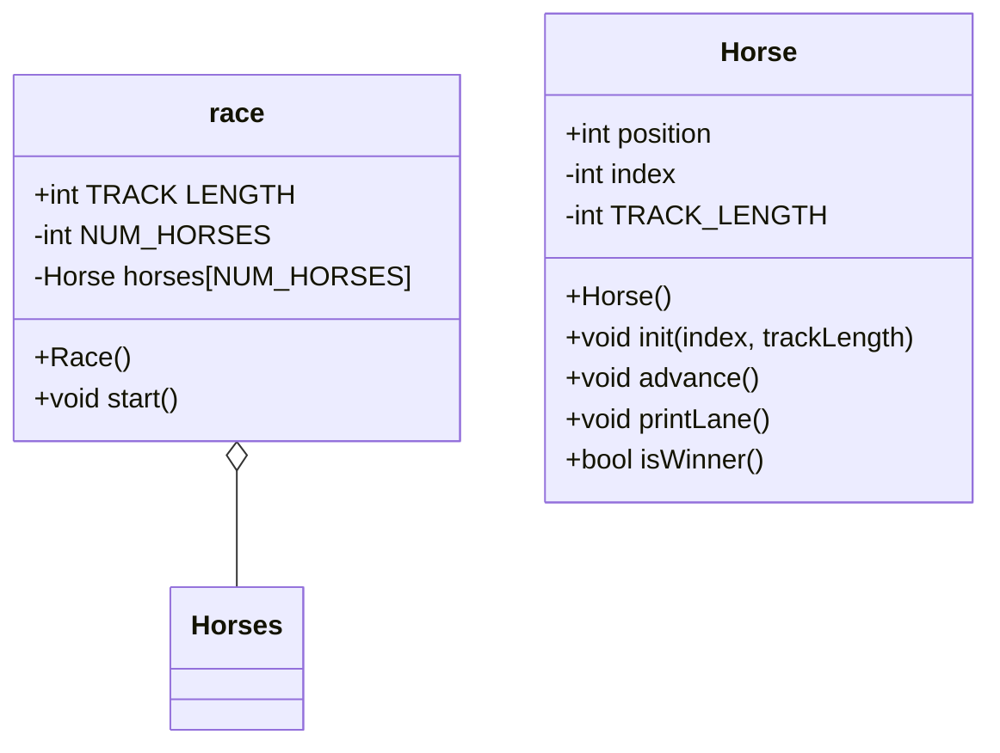

    in header
        int TRACKLENGTH to 15
        set static constant int NUM HORSES = 5;
        intilzie Horse horses[NUMHORSES]
    in constructor
        go through each horse
        intiziulee  
Race()
void start()

Horse Class

Horses{
    int position 
    int index
    int TRACK-LENGTH

    Horse()
        void init(index, trackLength)
        void advance()
        void printLane()
        bool isWinner()

 Main()

    seed random number generatoor
    instantiate race instamce
    start race

